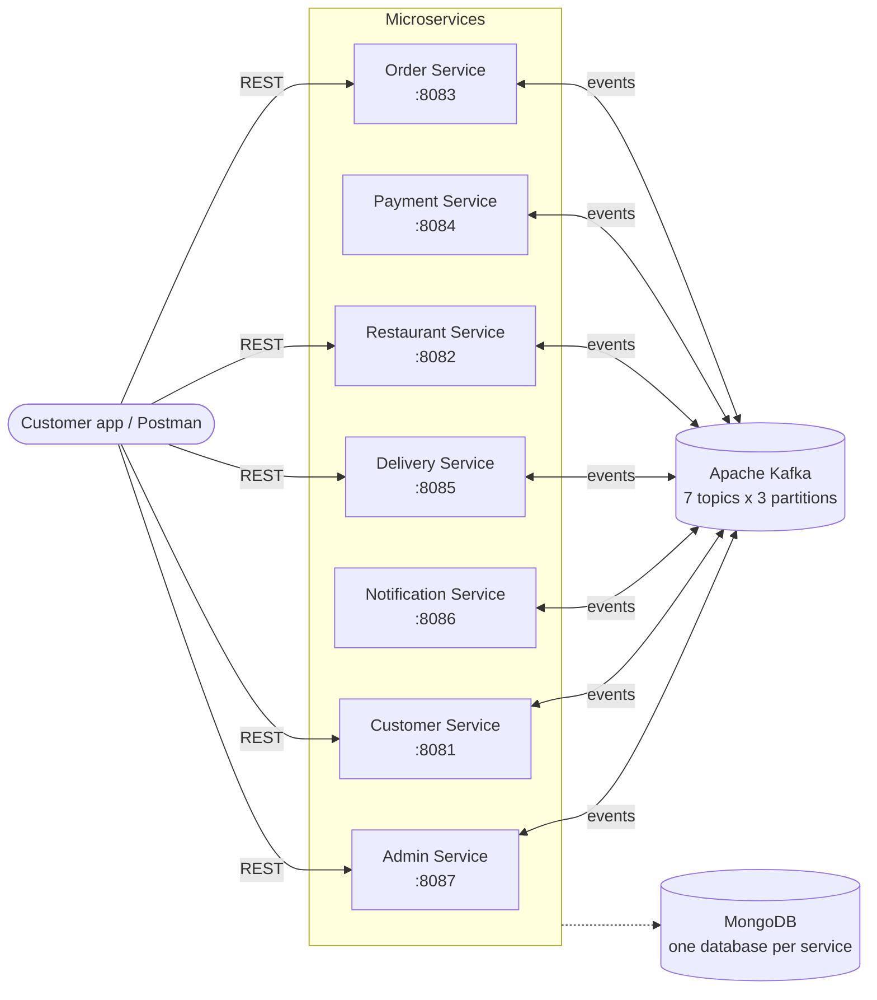
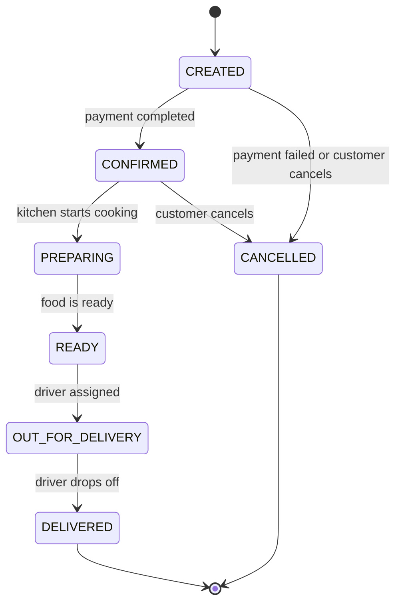

# Distributed Food Delivery Platform

**DSA612S – Distributed Systems and Applications · Assignment 2**
Namibia University of Science and Technology (NUST)

A distributed food delivery platform built as **7 Ballerina microservices** that coordinate through **Apache Kafka** events. Each service owns its own **MongoDB** database, and the whole platform starts with a single `docker compose up`.

When a customer places an order, the payment is processed, the restaurant cooks it, a driver is assigned and the food is delivered. Every step happens asynchronously through Kafka, so no service ever calls another service directly.

---

## Table of contents

1. [Architecture](#architecture)
2. [Order lifecycle](#order-lifecycle)
3. [Services](#services)
4. [Kafka topics](#kafka-topics)
5. [Databases](#databases)
6. [Project structure](#project-structure)
7. [How to run](#how-to-run)
8. [Demo walkthrough](#demo-walkthrough)
9. [Fault tolerance demo](#fault-tolerance-demo)
10. [API reference](#api-reference)
11. [Design decisions](#design-decisions)
12. [Troubleshooting](#troubleshooting)
13. [Future work](#future-work)

---

## Architecture



**Key principles**

- **Event-driven:** services publish what happened to Kafka, and other services react. There are no direct service-to-service calls in the order lifecycle.
- **Single owner of order state:** only the Order Service changes an order's status, through its state machine. Other services publish events that the Order Service turns into status changes.
- **Database per service:** each service has its own MongoDB database and never reads another service's data.
- **Read models:** the Customer, Notification and Admin services build their own copies of the data they need from Kafka events.

### Technology stack

| Concern | Technology |
| --- | --- |
| Microservices | Ballerina (Swan Lake) |
| Messaging | Apache Kafka 3.9 (KRaft mode, no ZooKeeper) |
| Persistence | MongoDB 7 |
| Containerisation | Docker, Docker Compose |
| Monitoring tools | Kafka UI, Mongo Express |

---

## Order lifecycle



Any other transition (for example CREATED straight to DELIVERED) is rejected by the Order Service with **409 Conflict**.

### How one order travels through the system

1. The customer calls `POST /orders`. The **Order Service** saves it as `CREATED` and publishes `orders.created`.
2. The **Payment Service** simulates the payment (90% success rate) and publishes `payments.completed` or `payments.failed`.
3. The **Order Service** moves the order to `CONFIRMED` (or `CANCELLED`) and publishes `orders.status-changed`.
4. The **Restaurant Service** adds the paid order to its kitchen queue and reduces the stock of each menu item.
5. Kitchen staff call the kitchen endpoints, which publish `PREPARING` and then `READY` on `kitchen.updates`.
6. When the order is `READY`, the **Delivery Service** assigns a free driver and publishes `delivery.assigned`, so the order becomes `OUT_FOR_DELIVERY`.
7. The driver confirms drop-off, the Delivery Service publishes `delivery.completed`, and the order becomes `DELIVERED`.
8. Throughout, the **Notification Service** sends SMS, email and push alerts, the **Customer Service** updates order history, and the **Admin Service** updates its reports.

---

## Services

| Service | Port | Responsibility |
| --- | --- | --- |
| **Customer** | 8081 | Customer accounts, delivery addresses, order history (built from events) |
| **Restaurant** | 8082 | Restaurants, digital menus, real-time inventory, opening hours, kitchen queue |
| **Order** | 8083 | The central order state machine and lifecycle, with a full status history per order |
| **Payment** | 8084 | Simulated payment processing with duplicate-charge protection |
| **Delivery** | 8085 | Driver management, automatic driver assignment (first come, first served), delivery tracking |
| **Notification** | 8086 | Multi-channel alerts (SMS, email, push) to customers, restaurants and drivers |
| **Admin** | 8087 | Reports on orders by status, restaurant statistics and delivery performance |

---

## Kafka topics

Every topic has **3 partitions**. Every message uses the **`orderId` as its key**, so all events for one order land in the same partition and are processed in order. Values are JSON.

| Topic | Producer | Consumers |
| --- | --- | --- |
| `orders.created` | Order | Payment, Restaurant, Notification, Customer, Admin |
| `payments.completed` | Payment | Order |
| `payments.failed` | Payment | Order |
| `orders.status-changed` | Order | Restaurant, Delivery, Notification, Customer, Admin |
| `kitchen.updates` | Restaurant | Order |
| `delivery.assigned` | Delivery | Order, Notification, Admin |
| `delivery.completed` | Delivery | Order, Admin |

Topics are created automatically at startup by the `kafka-init` container. Automatic topic creation is disabled, so every topic is created on purpose with the right partition count.

### Example event (`orders.status-changed`)

```json
{
  "orderId": "ORD-04E2240A",
  "customerId": "CUST-001",
  "restaurantId": "REST-9528585E",
  "deliveryAddress": "5 Robert Mugabe Ave, Windhoek",
  "oldStatus": "CREATED",
  "newStatus": "CONFIRMED",
  "totalAmount": 255.0,
  "timestamp": "2026-10-05T15:59:26.112Z"
}
```

---

## Databases

Each service owns its own MongoDB database (the database-per-service pattern).

| Service | Database | Collections |
| --- | --- | --- |
| Customer | `customer_db` | `customers`, `order_history` |
| Restaurant | `restaurant_db` | `restaurants` (with embedded menus), `kitchen_orders` |
| Order | `order_db` | `orders` (with embedded status history) |
| Payment | `payment_db` | `payments` |
| Delivery | `delivery_db` | `drivers`, `deliveries` |
| Notification | `notification_db` | `notifications` |
| Admin | `admin_db` | `orders`, `deliveries` (read models for reporting) |

---

## Project structure

```
Food_Delivery_Platform/
├── docker-compose.yml          # Kafka, MongoDB, dashboards and all 7 services
├── build-all.ps1               # Builds every service into a runnable .jar
├── README.md
└── services/
    ├── customer-service/       # types.bal, main.bal, consumers.bal, Dockerfile
    ├── restaurant-service/     # types.bal, clients.bal, restaurant_logic.bal, main.bal, consumers.bal, Dockerfile
    ├── order-service/          # Types.bal, Clients.bal, Order_Logic.bal, main.bal, Consumers.bal, Dockerfile
    ├── payment-service/        # Types.bal, main.bal, Dockerfile
    ├── delivery-service/       # types.bal, clients.bal, delivery_logic.bal, main.bal, consumers.bal, Dockerfile
    ├── notification-service/   # types.bal, main.bal, consumers.bal, Dockerfile
    └── admin-service/          # types.bal, main.bal, consumers.bal, Dockerfile
```

---

## How to run

### Prerequisites

- **Docker Desktop**, running (Engine running)
- **Ballerina Swan Lake** (2201.12 or later), to build the services
- **Git**

### Step 1: Clone the repository

```bash
git clone <this-repository-url>
cd Food_Delivery_Platform
```

### Step 2: Build all services

Each service is compiled into a runnable `.jar` file, which its Dockerfile copies into the container.

**Windows (PowerShell):**

```powershell
powershell -ExecutionPolicy Bypass -File .\build-all.ps1
```

**macOS / Linux:**

```bash
for s in customer restaurant order payment delivery notification admin; do
  (cd services/$s-service && bal build)
done
```

### Step 3: Start the whole platform

```bash
docker compose up -d --build
```

Docker Compose starts Kafka first, waits until it is healthy, creates the 7 topics, starts MongoDB, and only then starts the 7 services.

### Step 4: Check that everything is running

```bash
docker compose ps
```

All 7 services, plus `kafka`, `mongo`, `kafka-ui` and `mongo-express`, should show **Up**. The `kafka-init` container exits by design after creating the topics.

### Dashboards

| Tool | URL | Login |
| --- | --- | --- |
| Kafka UI (topics, messages, consumer groups) | http://localhost:8090 | None |
| Mongo Express (databases and documents) | http://localhost:8091 | `admin` / `admin123` |

### Stopping

```bash
docker compose down        # stop and remove containers (data in MongoDB is kept)
docker compose down -v     # also delete the MongoDB data volume
```

### Running a single service outside Docker (for development)

With the infrastructure running in Docker, any service can be run directly. Its defaults point to `localhost:29092` (Kafka) and `mongodb://localhost:27017`.

```bash
cd services/order-service
bal run
```

Inside Docker, the services reach Kafka at `kafka:9092` and MongoDB at `mongodb://mongo:27017`. These values are passed in by `docker-compose.yml` through Ballerina's `-C` configurable arguments.

---

## Demo walkthrough

A complete order, from placement to delivery, using PowerShell. Run all commands in the **same** terminal, because later steps reuse the saved variables.

**1. Create a restaurant and a menu item**

```powershell
$rest = Invoke-RestMethod -Uri http://localhost:8082/restaurants -Method Post -ContentType "application/json" -Body (@{ name = "Mama's Kapana Spot"; address = "Katutura, Windhoek"; openingHour = 0; closingHour = 24 } | ConvertTo-Json)

$kapana = Invoke-RestMethod -Uri "http://localhost:8082/restaurants/$($rest.restaurantId)/menu" -Method Post -ContentType "application/json" -Body (@{ name = "Kapana Platter"; price = 85.0; stock = 10 } | ConvertTo-Json)
```

**2. Register a driver**

```powershell
$driver = Invoke-RestMethod -Uri http://localhost:8085/drivers -Method Post -ContentType "application/json" -Body (@{ name = "Johannes"; phone = "081 222 3333"; vehicle = "Motorbike" } | ConvertTo-Json)
```

**3. Place an order**

```powershell
$body = @{
    customerId = "CUST-001"
    restaurantId = $rest.restaurantId
    deliveryAddress = "5 Robert Mugabe Ave, Windhoek"
    items = @( @{ itemId = $kapana.itemId; name = "Kapana Platter"; quantity = 3; price = 85.0 } )
} | ConvertTo-Json -Depth 5

$order = Invoke-RestMethod -Uri http://localhost:8083/orders -Method Post -Body $body -ContentType "application/json"
Start-Sleep 4
Invoke-RestMethod "http://localhost:8083/orders/$($order.orderId)" | Format-Table orderId, status
```

Expected: `CONFIRMED`. About 10% of payments fail on purpose; in that case the order is `CANCELLED`, so place another one.

**4. The kitchen cooks the order**

```powershell
Invoke-RestMethod -Uri "http://localhost:8082/restaurants/$($rest.restaurantId)/kitchen/$($order.orderId)/preparing" -Method Put | Out-Null
Invoke-RestMethod -Uri "http://localhost:8082/restaurants/$($rest.restaurantId)/kitchen/$($order.orderId)/ready" -Method Put | Out-Null
Start-Sleep 4
Invoke-RestMethod "http://localhost:8083/orders/$($order.orderId)" | Format-Table orderId, status
```

Expected: `OUT_FOR_DELIVERY`, because a free driver was assigned automatically.

**5. The driver delivers the order**

```powershell
$del = (Invoke-RestMethod "http://localhost:8085/deliveries?orderId=$($order.orderId)")[0]
Invoke-RestMethod -Uri "http://localhost:8085/deliveries/$($del.deliveryId)/complete" -Method Post | Out-Null
Start-Sleep 3
(Invoke-RestMethod "http://localhost:8083/orders/$($order.orderId)").statusHistory | Format-Table status, at, note
```

Expected result:

```
status           note
------           ----
CREATED          Order placed
CONFIRMED        Payment COMPLETED (PAY-...)
PREPARING        Kitchen update
READY            Kitchen update
OUT_FOR_DELIVERY Driver DRV-...
DELIVERED        Driver DRV-...
```

**6. See what the other services recorded**

```powershell
(Invoke-RestMethod "http://localhost:8086/notifications?orderId=$($order.orderId)") | Format-Table recipientType, channel, message -Wrap
(Invoke-RestMethod http://localhost:8087/reports/restaurants) | Format-Table restaurantId, totalOrders, delivered, revenue
(Invoke-RestMethod "http://localhost:8081/customers/CUST-001/orders") | Format-Table orderId, status, totalAmount
```

> **Note for Windows PowerShell 5.1:** when an endpoint returns a list, wrap the call in brackets, `(Invoke-RestMethod ...)`, so that PowerShell displays each item separately.

---

## Fault tolerance demo

This shows that no orders are lost when a service crashes.

```powershell
# 1. Stop the Payment Service
docker compose stop payment-service

# 2. Place an order (step 3 of the walkthrough). It stays CREATED, because nobody processes the payment.

# 3. Start the Payment Service again
docker compose start payment-service

# 4. Check the order again after a few seconds. It is now CONFIRMED.
```

Kafka stored the `orders.created` event while the Payment Service was down. Each consumer group's offset is committed in Kafka, so when the service restarts it resumes from its last committed offset and processes the missed event. In Kafka UI, the `payment-service` consumer group shows a **lag of 1** while the service is down, and the lag returns to 0 after the restart.

---

## API reference

All error responses have the form `{"message": "..."}`.

### Customer Service (8081)

| Method | Endpoint | Description |
| --- | --- | --- |
| POST | `/customers` | Register a customer (`name`, `email`, `phone`) |
| GET | `/customers` | List all customers |
| GET | `/customers/{customerId}` | Get one customer |
| POST | `/customers/{customerId}/addresses` | Add a delivery address (`label`, `street`, `city`) |
| GET | `/customers/{customerId}/addresses` | List a customer's addresses |
| GET | `/customers/{customerId}/orders` | Order history (built from Kafka events) |

### Restaurant Service (8082)

| Method | Endpoint | Description |
| --- | --- | --- |
| POST | `/restaurants` | Register a restaurant (`name`, `address`, `openingHour`, `closingHour`) |
| GET | `/restaurants` | List all restaurants |
| GET | `/restaurants/{restaurantId}` | Get one restaurant with its menu |
| GET | `/restaurants/{restaurantId}/open` | Whether the restaurant is open right now (Windhoek time) |
| POST | `/restaurants/{restaurantId}/menu` | Add a menu item (`name`, `price`, `stock`) |
| GET | `/restaurants/{restaurantId}/menu` | Get the menu with live stock levels |
| PUT | `/restaurants/{restaurantId}/menu/{itemId}/stock` | Restock an item (`stock`) |
| GET | `/restaurants/{restaurantId}/kitchen` | The kitchen queue (WAITING and PREPARING orders) |
| PUT | `/restaurants/{restaurantId}/kitchen/{orderId}/preparing` | Start cooking (only when the restaurant is open) |
| PUT | `/restaurants/{restaurantId}/kitchen/{orderId}/ready` | Mark the food as ready |

### Order Service (8083)

| Method | Endpoint | Description |
| --- | --- | --- |
| POST | `/orders` | Place an order (`customerId`, `restaurantId`, `deliveryAddress`, `items`) |
| GET | `/orders` | List all orders (optional `?customerId=`) |
| GET | `/orders/{orderId}` | Get one order, including its full `statusHistory` |
| PUT | `/orders/{orderId}/cancel` | Cancel an order (only before cooking starts) |

### Payment Service (8084)

| Method | Endpoint | Description |
| --- | --- | --- |
| GET | `/payments` | List all payments |
| GET | `/payments/{orderId}` | Get the payment for an order |

### Delivery Service (8085)

| Method | Endpoint | Description |
| --- | --- | --- |
| POST | `/drivers` | Register a driver (`name`, `phone`, `vehicle`). Starts AVAILABLE |
| GET | `/drivers` | List drivers with status and completed deliveries |
| PUT | `/drivers/{driverId}/status` | Go `AVAILABLE` or `OFFLINE` (not allowed while BUSY) |
| GET | `/drivers/{driverId}/current` | The driver's current delivery |
| GET | `/deliveries` | List deliveries (optional `?orderId=` and `?status=`) |
| GET | `/deliveries/{deliveryId}` | Get one delivery |
| POST | `/deliveries/{deliveryId}/complete` | The driver confirms drop-off |

### Notification Service (8086)

| Method | Endpoint | Description |
| --- | --- | --- |
| GET | `/notifications` | List sent notifications (optional `?recipientId=` and `?orderId=`) |

### Admin Service (8087)

| Method | Endpoint | Description |
| --- | --- | --- |
| GET | `/reports/summary` | Number of orders in each status |
| GET | `/reports/restaurants` | Orders, deliveries, cancellations and revenue per restaurant |
| GET | `/reports/deliveries` | Delivery counts and average delivery time, overall and per driver |

---

## Design decisions

**Event-driven choreography instead of direct calls.** Services never call each other in the order lifecycle. This keeps them loosely coupled: a new service (for example loyalty points) can be added by subscribing to existing topics, without changing any existing code.

**One owner for order state.** Only the Order Service changes an order's status, through an explicit state machine (`allowedTransitions`). The Restaurant and Delivery services publish facts ("cooking started", "driver assigned"), and the Order Service decides what they mean for the order. Illegal transitions are rejected.

**Partitioning by orderId.** Every event is keyed by `orderId`. Kafka guarantees ordering only within a partition, so keying by `orderId` guarantees that the events of one order are always processed in the order they happened, while different orders are spread across 3 partitions for parallelism.

**Idempotent consumers.** Kafka guarantees at-least-once delivery, so an event can occasionally arrive twice. Every consumer is safe against duplicates:

| Service | Duplicate protection |
| --- | --- |
| Order | Ignores a status change to the status the order already has |
| Payment | Never charges the same order twice |
| Restaurant | Stores each incoming order once and reduces stock only once |
| Delivery | Creates at most one delivery per order |
| Notification | Builds a deterministic ID per order, event, recipient and channel, so no message is sent twice |

**Database per service and read models.** Each service owns its data. The Customer, Notification and Admin services never query other services; they build their own read models from events, so they keep working even if the Order Service is down.

**Inventory consistency.** Stock is reduced only when the payment is confirmed (not when the order is placed), and it is restored if a paid order is cancelled before cooking starts.

**Fault tolerance.** Kafka persists events, and consumer groups resume from their committed offsets after a restart. Docker Compose adds `restart: on-failure` for every service, and health checks make the services wait until Kafka is ready and the topics exist before they start.

---

## Troubleshooting

| Problem | Fix |
| --- | --- |
| `failed to connect to the docker API` | Open Docker Desktop and wait for "Engine running" |
| `COPY failed: target/bin/... not found` | Build the services first (Step 2 of How to run) |
| `port is already allocated` | Another copy of the service is running (for example `bal run`). Stop it first |
| `Server might not be available at localhost:29092` | Kafka is not running. Run `docker compose up -d` |
| A service shows `Restarting` | Check its logs with `docker compose logs <service-name> --tail 30` |
| An order stays `CANCELLED` | The simulated payment failed (10% chance). Place another order |

---

## Future work

- A web interface for customers, kitchen staff and drivers
- Surge pricing based on demand and driver availability
- Monitoring with Prometheus and Grafana
- Live driver location simulation and route optimisation
- Authentication and authorisation for each type of user

---

## Author

| Name | Student number |
| --- | --- |
| [Your full name] | [Your student number] |
